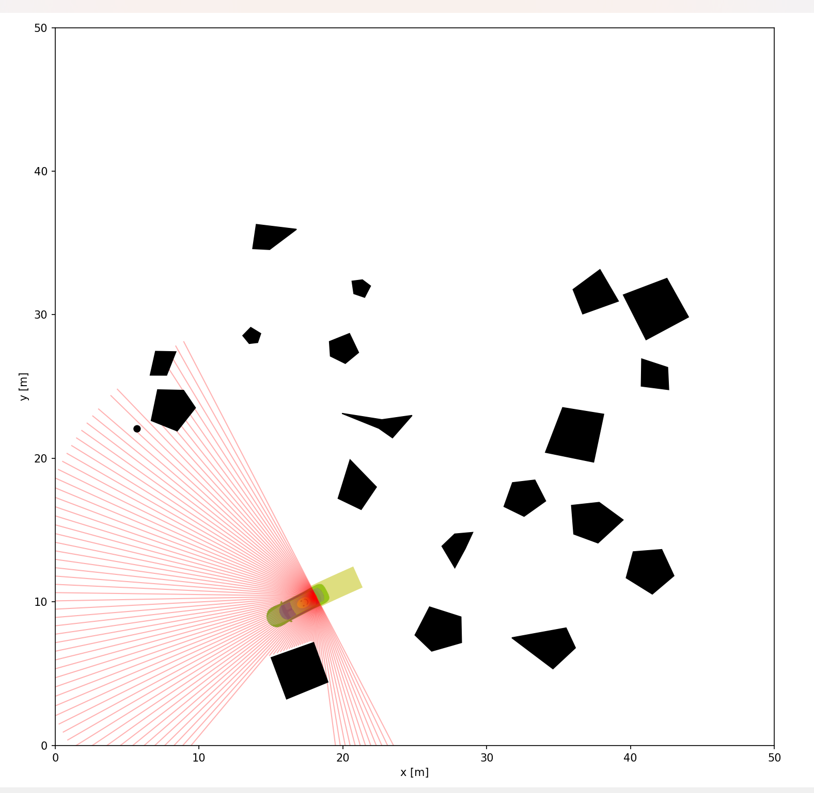

# AckermannRL: Obstacle Avoidance with TD3 Reinforcement Learning

Implementation of obstacle avoidance for an Ackermann-steering robot using Twin Delayed Deep Deterministic Policy Gradient (TD3) reinforcement learning. The robot learns to navigate in environments with random obstacles without any specific goal position, focusing on efficient exploration while avoiding collisions.



## Project Overview

- Uses TD3 (Twin Delayed DDPG) reinforcement learning algorithm
- Simulates an Ackermann robot in a 2D environment with obstacles
- Trains the robot to navigate while avoiding collisions

## Environment

The simulation environment is based on the `irsim` library and includes:
- A 50x50 world with 20 randomly placed obstacles
- An Ackermann robot with 2D LiDAR sensor
- Moving obstacles with RVO (Reciprocal Velocity Obstacle) behavior
- Robot control through linear velocity and steering angle

## Dependencies

- Python 3.8+
- PyTorch
- NumPy
- Matplotlib
- irsim (robot simulation environment)

## Installation

1. Clone this repository:
```bash
git clone https://github.com/taherfattahi/ackermann-rl-obstacle-td3
cd ackermann-rl-obstacle-td3
```

2. Install the required packages:
```bash
pip install -r requirements.txt
```

## Project Structure

```
AckermannRL/
├── models/
│   └── TD3/
│       └── TD3.py          # TD3 implementation
├── sim.py                  # Simulation environment
├── utils.py                # Utility functions and buffer loading
├── replay_buffer.py        # Experience replay implementation
├── main.py                 # Main training script
├── evaluate.py             # Evaluation script
├── run_demo.py             # Interactive demo script
└── robot_world.yaml        # World configuration
```

## Training

To train the robot:

```bash
python main.py
```

Training parameters can be adjusted in the main.py file:
- `max_epochs`: Maximum number of training epochs
- `episodes_per_epoch`: Episodes per epoch
- `max_steps`: Maximum steps per episode
- `training_iterations`: Number of TD3 updates per training cycle
- `batch_size`: Batch size for TD3 updates

## Evaluation

To evaluate a trained model:

```bash
python evaluate.py --episodes 20 --save_plots
```

Options:
- `--episodes`: Number of evaluation episodes
- `--max_steps`: Maximum steps per episode
- `--save_plots`: Save trajectory plots
- `--render`: Render the environment during evaluation
- `--world_file`: YAML file for world configuration

## Demo

To run an interactive demo of a trained model:

```bash
python run_demo.py --save_video
```

Options:
- `--save_video`: Save a video of the demonstration
- `--max_steps`: Maximum steps to run
- `--delay`: Delay between steps for visualization
- `--world_file`: YAML file for world configuration

## Model Architecture

The TD3 implementation uses:
- Deep neural networks for actor and critic
- Twin critics for reduced overestimation
- Delayed policy updates
- Action and exploration noise for robust learning
- Target networks with soft updates

## State and Action Space

**State Space:**
- 20 downsampled LiDAR readings
- Minimum distance to obstacles
- Robot heading (x, y components)

**Action Space:**
- Linear velocity: [0, 4] m/s
- Steering angle: [-1, 1] radians

## Reward Function

The robot is rewarded for:
- Moving forward (higher velocity)
- Maintaining distance from obstacles
- Smooth steering

It receives penalties for:
- Collisions (-100)
- Being too close to obstacles
- Excessive steering

## Results

After training, the robot learns to:
- Navigate through the environment without collisions
- Maintain safe distances from obstacles
- Use efficient steering patterns

## Acknowledgments

- The TD3 algorithm
- Irsim simulation environment
